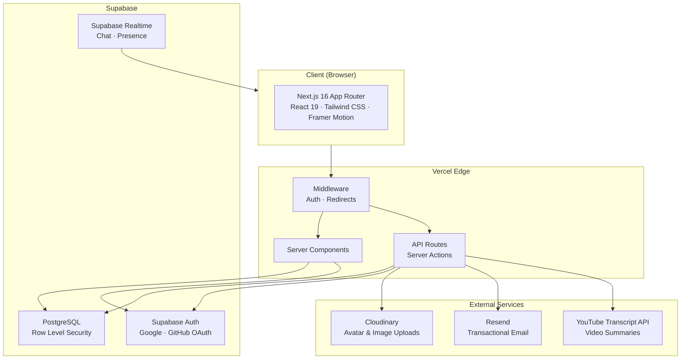
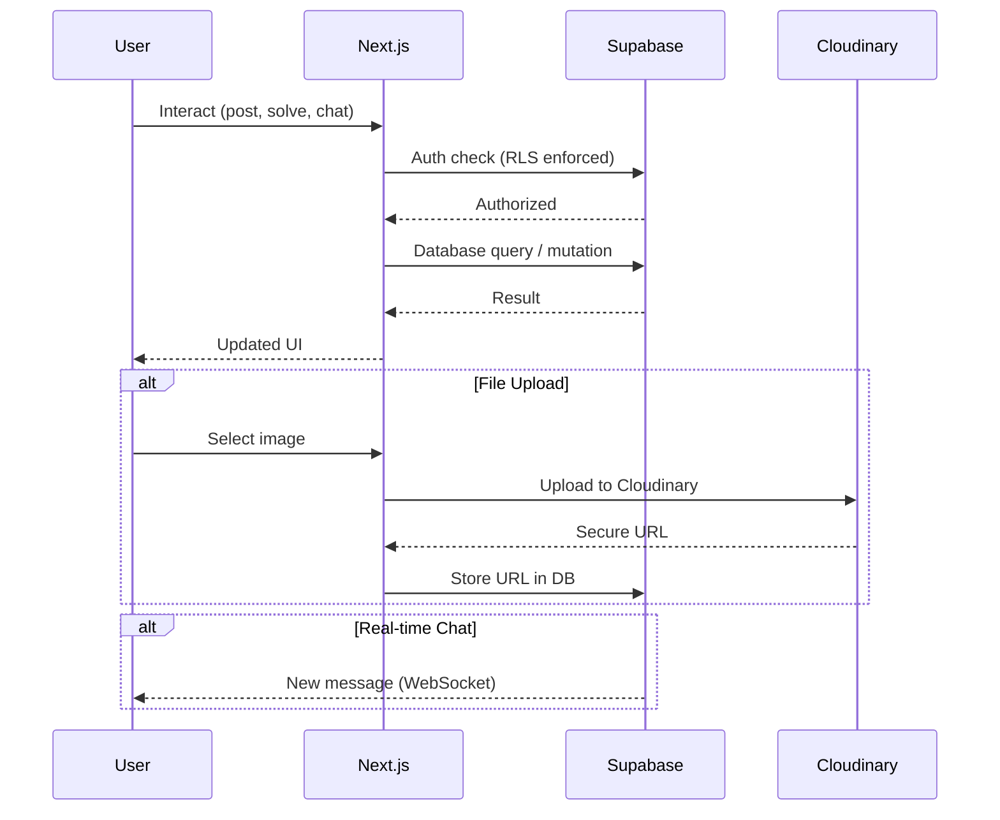
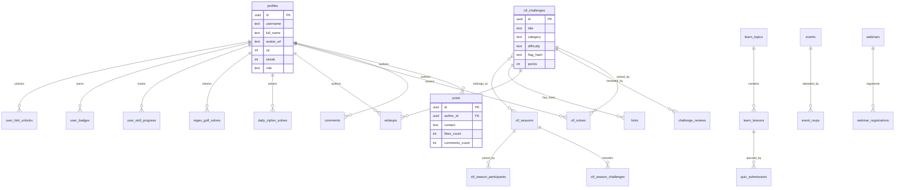

<div align="center">

<!-- Animated Logo -->
<svg width="150" height="150" viewBox="0 0 140 140" xmlns="http://www.w3.org/2000/svg" role="img" aria-label="Kleia animated logo">
  <defs>
    <linearGradient id="kGrad" x1="0%" y1="0%" x2="100%" y2="100%">
      <stop offset="0%" stop-color="#8b5cf6">
        <animate attributeName="stop-color" values="#8b5cf6;#06b6d4;#ec4899;#22d3ee;#8b5cf6" dur="8s" repeatCount="indefinite"/>
      </stop>
      <stop offset="50%" stop-color="#06b6d4">
        <animate attributeName="stop-color" values="#06b6d4;#ec4899;#22d3ee;#8b5cf6;#06b6d4" dur="8s" repeatCount="indefinite"/>
      </stop>
      <stop offset="100%" stop-color="#22d3ee">
        <animate attributeName="stop-color" values="#22d3ee;#8b5cf6;#ec4899;#06b6d4;#22d3ee" dur="8s" repeatCount="indefinite"/>
      </stop>
    </linearGradient>
  </defs>

  <!-- breathing glow core -->
  <circle cx="70" cy="70" r="46" fill="#a78bfa" opacity="0.14">
    <animate attributeName="opacity" values="0.14;0.32;0.14" dur="4s" repeatCount="indefinite"/>
    <animate attributeName="r" values="42;52;42" dur="4s" repeatCount="indefinite"/>
  </circle>

  <!-- outer dashed orbit -->
  <circle cx="70" cy="70" r="61" fill="none" stroke="url(#kGrad)" stroke-width="1.4" stroke-dasharray="6 7" opacity="0.8">
    <animateTransform attributeName="transform" type="rotate" from="0 70 70" to="360 70 70" dur="30s" repeatCount="indefinite"/>
  </circle>

  <!-- inner counter-rotating ring -->
  <circle cx="70" cy="70" r="51" fill="none" stroke="#22d3ee" stroke-width="1" stroke-dasharray="1 9" opacity="0.5">
    <animateTransform attributeName="transform" type="rotate" from="360 70 70" to="0 70 70" dur="18s" repeatCount="indefinite"/>
  </circle>

  <!-- hexagon -->
  <polygon points="70,32 102,51 102,89 70,108 38,89 38,51" fill="none" stroke="url(#kGrad)" stroke-width="1.1" opacity="0.35">
    <animateTransform attributeName="transform" type="rotate" from="0 70 70" to="-360 70 70" dur="40s" repeatCount="indefinite"/>
  </polygon>

  <!-- K letterform (draw-on) -->
  <path d="M54 46 L54 94 M54 70 L86 46 M54 70 L86 94" fill="none" stroke="url(#kGrad)" stroke-width="6.5" stroke-linecap="round" stroke-linejoin="round">
    <animate attributeName="stroke-dasharray" values="0 200;200 200" dur="1.4s" fill="freeze"/>
    <animate attributeName="stroke-dashoffset" values="200;0" dur="1.4s" fill="freeze"/>
  </path>

  <!-- orbit satellites -->
  <g>
    <animateTransform attributeName="transform" type="rotate" from="0 70 70" to="360 70 70" dur="9s" repeatCount="indefinite"/>
    <circle cx="70" cy="9" r="3.4" fill="#a78bfa"/>
  </g>
  <g>
    <animateTransform attributeName="transform" type="rotate" from="120 70 70" to="480 70 70" dur="14s" repeatCount="indefinite"/>
    <circle cx="70" cy="11" r="2.4" fill="#ec4899"/>
  </g>
  <g>
    <animateTransform attributeName="transform" type="rotate" from="240 70 70" to="600 70 70" dur="19s" repeatCount="indefinite"/>
    <circle cx="70" cy="10" r="2.0" fill="#22d3ee"/>
  </g>

  <!-- soft pulse ring -->
  <circle cx="70" cy="70" r="61" fill="none" stroke="#a78bfa" stroke-width="1" opacity="0">
    <animate attributeName="r" values="44;61" dur="3s" repeatCount="indefinite"/>
    <animate attributeName="opacity" values="0.5;0" dur="3s" repeatCount="indefinite"/>
  </circle>
</svg>

<br/>

<!-- ============ Wordmark ============ -->
<svg width="280" height="62" viewBox="0 0 280 62" xmlns="http://www.w3.org/2000/svg" role="img" aria-label="kleia wordmark">
  <defs>
    <linearGradient id="kWord" x1="0%" y1="0%" x2="100%" y2="0%">
      <stop offset="0%" stop-color="#c4b5fd"><animate attributeName="stop-color" values="#c4b5fd;#67e8f9;#f9a8d4;#c4b5fd" dur="8s" repeatCount="indefinite"/></stop>
      <stop offset="100%" stop-color="#67e8f9"><animate attributeName="stop-color" values="#67e8f9;#f9a8d4;#c4b5fd;#67e8f9" dur="8s" repeatCount="indefinite"/></stop>
    </linearGradient>
  </defs>
  <text x="140" y="40" text-anchor="middle" font-family="-apple-system,BlinkMacSystemFont,'Segoe UI',Roboto,sans-serif" font-size="40" font-weight="900" fill="url(#kWord)" letter-spacing="-1.5">kleia</text>
  <text x="140" y="56" text-anchor="middle" font-family="-apple-system,BlinkMacSystemFont,'Segoe UI',Roboto,sans-serif" font-size="10" font-weight="600" letter-spacing="4" fill="#9ca3af">LEARN TOGETHER · GROW TOGETHER</text>
</svg>

<p><b>Learn Together, Grow Together.</b></p>

<p>
A community platform where friends learn skills, solve CTF challenges, track progress, and grow together — all in one place.
</p>

<br/>

<a href="https://www.kleia.site">
  
</a>
<a href="https://nextjs.org/">
  
</a>
<a href="https://supabase.com/">
  
</a>
<a href="https://tailwindcss.com/">
  
</a>
<a href="https://github.com/LikeNmuFF/kleia.py/blob/main/LICENSE.md">
  
</a>
<a href="https://github.com/LikeNmuFF/kleia.py/blob/main/CONTRIBUTING.md">
  
</a>
<br/><br/>
<a href="https://github.com/LikeNmuFF/kleia.py">
  
</a>
<a href="https://github.com/LikeNmuFF/kleia.py">
  
</a>
<a href="https://github.com/LikeNmuFF/kleia.py/issues">
  
</a>
<a href="https://github.com/LikeNmuFF/kleia.py/pulse">
  
</a>
<a href="https://github.com/LikeNmuFF/kleia.py/graphs/contributors">
  
</a>

</div>

<br/>

<!-- ============ Animated divider ============ -->
<div align="center">
<svg width="320" height="6" viewBox="0 0 320 6" xmlns="http://www.w3.org/2000/svg" aria-hidden="true">
  <defs>
    <linearGradient id="kDiv" x1="0%" y1="0%" x2="100%" y2="0%">
      <stop offset="0%" stop-color="#8b5cf6"><animate attributeName="stop-color" values="#8b5cf6;#22d3ee;#ec4899;#8b5cf6" dur="6s" repeatCount="indefinite"/></stop>
      <stop offset="50%" stop-color="#22d3ee"><animate attributeName="stop-color" values="#22d3ee;#ec4899;#8b5cf6;#22d3ee" dur="6s" repeatCount="indefinite"/></stop>
      <stop offset="100%" stop-color="#ec4899"><animate attributeName="stop-color" values="#ec4899;#8b5cf6;#22d3ee;#ec4899" dur="6s" repeatCount="indefinite"/></stop>
    </linearGradient>
  </defs>
  <rect x="0" y="2" width="320" height="2" rx="1" fill="url(#kDiv)"/>
</svg>
</div>

<br/>

---

## What is Kleia?

Kleia is a **free, open-source community platform** built for study groups, friends, and learners. It combines social features, education, and competitive challenges into a single experience.

Whether you're learning Python, grinding CTF challenges, or just staying in touch with your study group — Kleia keeps everything in one place.

<br/>

---

## Core Modules

### 📰 Feed & Social

A shared feed where members post updates, share resources, and discuss topics. Think of it as your group's internal social network — posts with likes, comments, markdown support, and image attachments via Cloudinary.

### 💬 Real-time Chat

Direct messages and group conversations powered by Supabase Realtime. Messages are delivered instantly, with presence indicators showing who's online.

### 📚 Learn

Built-in interactive lessons covering **Python Basics** (8 lessons), **Python Intermediate** (4 lessons), and **Linux Basics** (4 lessons). Each lesson includes reading material and a quiz. Complete quizzes to earn XP and unlock the next lesson.

### 🏴 CTF Challenges

A full capture-the-flag platform with five categories:

| Category | Description |
|----------|-------------|
| **Web** | Inspect source, robots.txt, and web tricks |
| **Crypto** | Ciphers, encodings, and cryptanalysis |
| **PWN** | Binary exploitation |
| **Forensics** | Analyze files and artifacts |
| **Misc** | Everything else |

Flags follow the `KLEIA{...}` format and are validated server-side. Challenges can have hints (costing XP to unlock), reviews with star ratings, and community-contributed writeups.

### 🌿 Skill Tree

A visual progression system that unlocks as you solve challenges. Nodes are organized by category (Web, Crypto, Forensics, Misc) and difficulty (Easy → Hard). Solve enough challenges in a category to unlock the next tier.

### 🏆 Seasons

Monthly themed competitions with separate leaderboards. Admins create seasons with date ranges and bonus-point challenges. Past seasons remain viewable for archival.

### ⚡ Regex Golf

A competitive regex puzzle game — write the shortest regex that matches a set of green strings and rejects red strings. Live validation shows results in real-time. Three difficulty tiers.

### 🔐 Daily Cipher

A new cipher puzzle every day (Caesar, Atbash, Base64, Hex, Reverse, or Vigenère). The plaintext is always `KLEIA{daily_cipher_YYYY-MM-DD}`. Solve it to maintain your streak.

### 📊 Leaderboards & Gamification

Earn XP across every activity:

| Action | XP |
|--------|----|
| Complete a lesson | +10 |
| Submit a writeup | +20 |
| Solve a CTF challenge | +10–100 (by difficulty) |
| Solve daily cipher | +25 |
| Daily login | +5 |

13+ unique badges for milestones, a daily mission system, and streak tracking keep you motivated.

### 👥 Members & Profiles

Browse the community, search by name/username/bio, and view profiles with XP badges, streaks, CTF stats, and skill trees. Real-time presence shows who's online.

### 📅 Events

Schedule study sessions, workshops, and meetups. Track RSVPs and attendance.

### 🎓 Webinars & Certificates

Admins create free webinars with live links and capacity. Attendance is tracked server-side, and certificates are generated on completion.

### 🏫 Cohorts

Faculty accounts can create cohorts, assign content, and view aggregated skill data for their group — scoped so each faculty only sees their own students.

### 🤝 Peer Matching

Get matched with study partners based on complementary skills — strong in one area, learning in another.

### 🏋️ Teams

Form teams of 5+ members, track daily activity on a shared calendar heatmap, and compete on the team leaderboard. Teams with at least 5 accepted members can generate an API key to fetch their streak and calendar stats programmatically.

📘 **API documentation:** see [docs/api.md](docs/api.md) or the in-app reference at [`/teams/api-docs`](https://www.kleia.site/teams/api-docs).

<br/>

---

## Architecture



### Data Flow



### Database Schema Overview



<br/>

---

## Tech Stack

| Layer | Technology |
|-------|-----------|
| **Framework** | [Next.js 16](https://nextjs.org/) (App Router) |
| **Language** | [TypeScript](https://www.typescriptlang.org/) |
| **UI** | [Tailwind CSS](https://tailwindcss.com/) + [Framer Motion](https://www.framer.com/motion/) |
| **Database** | [Supabase](https://supabase.com/) (PostgreSQL with RLS) |
| **Auth** | [Supabase Auth](https://supabase.com/auth) (Google + GitHub OAuth) |
| **Realtime** | [Supabase Realtime](https://supabase.com/realtime) (Chat + Presence) |
| **Uploads** | [Cloudinary](https://cloudinary.com/) (Avatar & Image uploads) |
| **Email** | [Resend](https://resend.com/) (Transactional email) |
| **Markdown** | [react-markdown](https://github.com/remarkjs/react-markdown) + remark-gfm |
| **3D** | [Three.js](https://threejs.org/) (Landing page background) |
| **Deployment** | [Vercel](https://vercel.com/) |

<br/>

---

## Project Structure

```
kleia.py/
├── app/
│   ├── (auth)/              # Login, signup, forgot/reset password
│   ├── (main)/              # Authenticated app pages
│   │   ├── admin/           # Admin dashboard & CTF review queue
│   │   ├── ctf/             # Challenges, seasons, skill tree, writeups
│   │   ├── chat/            # Real-time messaging
│   │   ├── cipher/          # Daily cipher puzzle
│   │   ├── cohorts/         # Cohort management & assignments
│   │   ├── events/          # Event scheduling & RSVPs
│   │   ├── feed/            # Social feed with posts
│   │   ├── learn/           # Interactive lessons & quizzes
│   │   ├── leaderboard/     # CTF & achievement leaderboards
│   │   ├── members/         # Member directory & profiles
│   │   ├── peer-matching/   # Study partner matching
│   │   ├── profile/         # User profile & settings
│   │   ├── regex-golf/      # Regex puzzle game
│   │   └── webinars/        # Webinar registration & certificates
│   ├── (legal)/             # Terms, privacy, security pages
│   ├── actions/             # Server actions (DB mutations)
│   ├── api/                 # API route handlers
│   └── auth/                # Auth callback handlers
├── components/              # Reusable React components
│   ├── admin/               # Admin-specific UI
│   ├── ctf/                 # Challenge cards, reviews, writeups
│   ├── chat/                # Chat interface & providers
│   ├── cohorts/             # Cohort UI
│   ├── events/              # Event cards & forms
│   ├── feed/                # Post composer & feed items
│   ├── gamification/        # Badges, XP, missions
│   ├── landing/             # Landing page sections
│   ├── learn/               # Lesson reader & quiz
│   ├── members/             # Member cards & search
│   ├── nav/                 # Desktop & mobile navigation
│   ├── peer-matching/       # Match request UI
│   ├── profile/             # Profile settings & display
│   ├── webinars/            # Webinar forms & attendance
│   └── ui/                  # Shared UI primitives
├── lib/
│   ├── supabase/            # Supabase client helpers
│   ├── utils/               # Cipher, regex-golf, helpers
│   ├── hooks/               # Custom React hooks
│   └── context/             # React context providers
├── docs/                    # Developer docs (public API reference)
├── public/                  # Static assets (logo, robots.txt, sitemap)
└── supabase-migrations/     # SQL migrations (000–033)
```

<br/>

---

## Security

Kleia takes security seriously. Key practices:

- **Row Level Security (RLS)** enforced on all Supabase tables
- **Server-side validation** for all user input — never trust client-side alone
- **Auth middleware** verifies sessions on every protected route
- **Secrets** live only in environment variables, never committed
- **CTF flags** are stored as hashes; plaintext flags are never in the repository
- **Rate limiting** on AI-powered endpoints to prevent abuse
- **Dependency scanning** via `npm audit` and GitHub Actions

See [SECURITY.md](SECURITY.md) for the full vulnerability disclosure policy.

<br/>

---

## Contributing

We welcome contributions of all kinds — bug reports, features, documentation, and CTF challenge submissions.

See **[CONTRIBUTING.md](CONTRIBUTING.md)** for setup instructions, code style guidelines, and how to submit CTF challenges.

<br/>

---

## License

This project is licensed under the **[MIT License](LICENSE.md)**.

Copyright © 2026 Kleia (LikeNmuFF)

<br/>

---

<div align="center">

Made with ❤️ by **[LikeNmuFF](https://github.com/LikeNmuFF)**

**[kleia.site](https://www.kleia.site)** · [Security](SECURITY.md) · [Privacy](https://www.kleia.site/privacy) · [Terms](https://www.kleia.site/terms) · [Contributing](CONTRIBUTING.md)

</div>
